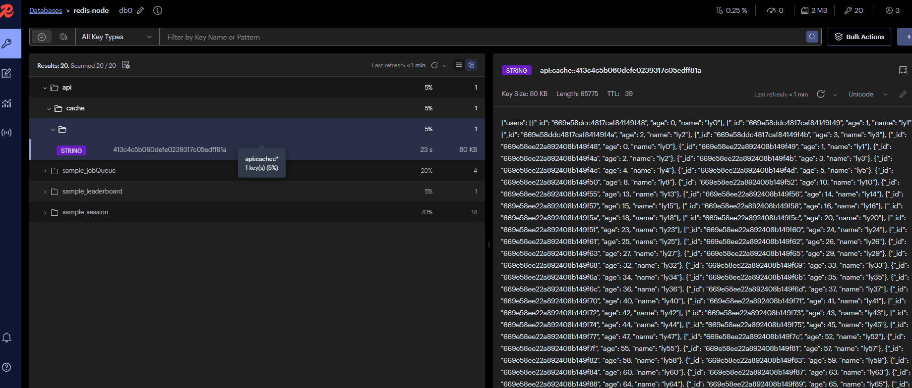

# pymongo-api

## Как запустить

Запускаем mongodb и приложение

```shell
docker compose up -d
```

Выполните эти команды одну за другой:
```bash
docker-compose exec configsvr01 sh -c "mongosh < /scripts/init-configsvr.js"
docker-compose exec shard01-a sh -c "mongosh < /scripts/init-shard01.js"
docker-compose exec shard02-a sh -c "mongosh < /scripts/init-shard02.js"
```

Подождите несколько секунд(30) пока сервер конфигурации и шарды выберут ведущие ноды

Выполните:
```bash
docker-compose exec router01 sh -c "mongosh < /scripts/init-router.js"
```

Проверьте документы на шардах:
```bash
docker-compose exec router01 sh -c "mongosh < /scripts/get-docs-count.js"
```

Проверьте статус набора реплик для каждого шарда
```bash
docker exec -it shard-01-node-a bash -c "echo 'rs.status()' | mongosh --port 27017" 
docker exec -it shard-02-node-a bash -c "echo 'rs.status()' | mongosh --port 27017" 
```

---------------

Получить данные по url: http://localhost:8080/helloDoc/users

После 1 попытки данные будут браться из кеша менее 100мс

Проверить кеш можно в утилите redis-insight по адресу http://localhost:5540/ 

host: redis-node

port: 7000



------------------

Сброс кластера
```bash
docker-compose down
docker-compose rm
docker-compose down -v --rmi all --remove-orphans
```

Мысли вслух:

1. Если мы говорим об отказоустойчивости, то консул и апи гейтвей так же надо реплицировать
2. Кеш можно иметь один инстанс, потеря кеша не сломает все наше приложение


ps. Все перепроверил, приложение работает с несколькими урлами в MONGODB_URL. 

Можно попробовать сбросить volume перед развертыванием -docker-compose down -v

Все работает корректно и в директории с репликой и директории с кэшем, скорее всего что-то с настройками в волюмах, может композ закешировал
